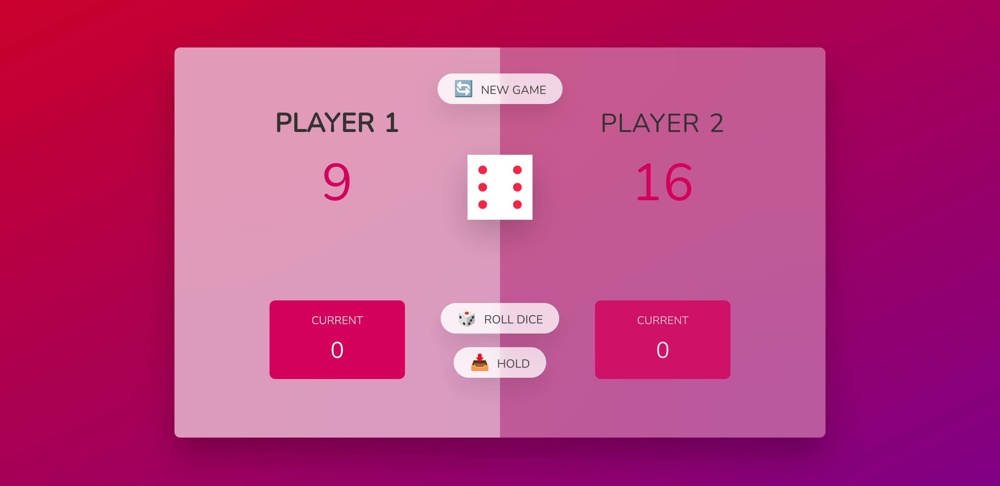

# Dice Game - Player vs Player

A fun two-player dice game built with **HTML**, **CSS**, and **JavaScript**. Players take turns to roll a dice, and the first player to reach a specified score wins the game!

## ✨ Features

- **Player vs Player**: Two players compete to reach the winning score.
- **Dice Rolling Mechanics**: Each player rolls a dice and accumulates points unless they roll a 1, which resets their current score.
- **Hold Option**: Players can choose to "Hold" and add their current score to their total score, passing the turn to the other player.
- **New Game Option**: Reset the game at any time and start fresh.
- **Responsive Design**: Compatible with different screen sizes for better gameplay experience.

## 🛠️ Technologies Used

- **HTML5**: For structuring the webpage.
- **CSS3**: For styling the user interface, including responsive layouts.
- **JavaScript (ES6)**: For handling the game logic such as rolling the dice, tracking scores, and switching turns.
